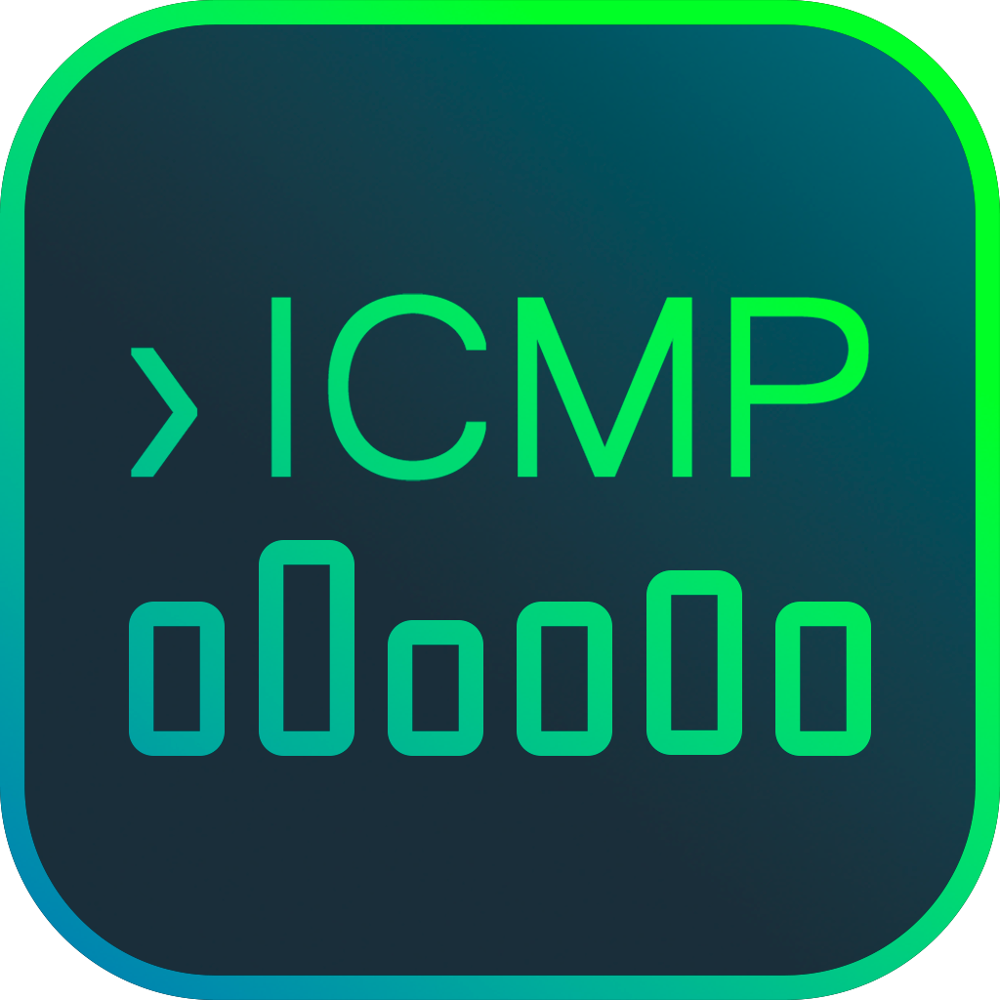
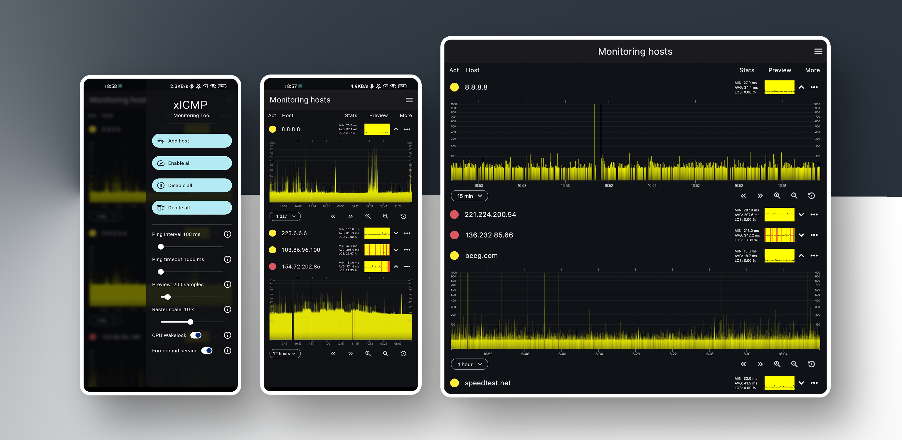

  

<h1 align="center">xICMP Monitoring tool</h1>
<h6 align="center">Portable network monitoring software</h6>

  

<strong>xICMP Monitoring tool</strong> is an mobile app for realtime and background network monitoring.
It is designed to provide a more informative way to analyze the quality of a network connection in real-time, much like <code>$ ping -f host</code> does using minimum delay between packets + minimum timeout so you cant lose any of problems out of your sight.
Data is displayed in detailed graphical form and can be used to perform line analysis on the go, or as standalone tool for ISPs to perform monitoring on client-end.

<h3>Features</h3>
<ul>
  <li>Fast and modern UI</li>
  <li>Real-time stats monitoring on the go</li>
  <li>Background monitoring with foreground service</li>
  <li>Direct ICMP connection using OS shell</li>
  <li>Root-less min delay + min timeout mode</li>
  <li>Detailed weight based histograms developed specifically for this app</li>
  <li>Exporting collected data-sets to csv</li>
</ul>

<h3>Platforms:</h3>
<ul>
  <li>Android 4.4+</li>
  <li>MacOS 10.15+</li>
  <li>Windows 7+</li>
</ul> 
  
<h3>Installation</h3>
<a href="https://github.com/digiboridev/xICMP-Monitoring-tool/releases/">Download</a>

<h3>Contacts:</h3>
<ul>
  <li><a href="mailto:digiborideveloper@gmail.com">Email</a></li>
  <li><a href="t.me/vladislavdev">Telegram</a></li>
</ul>
  